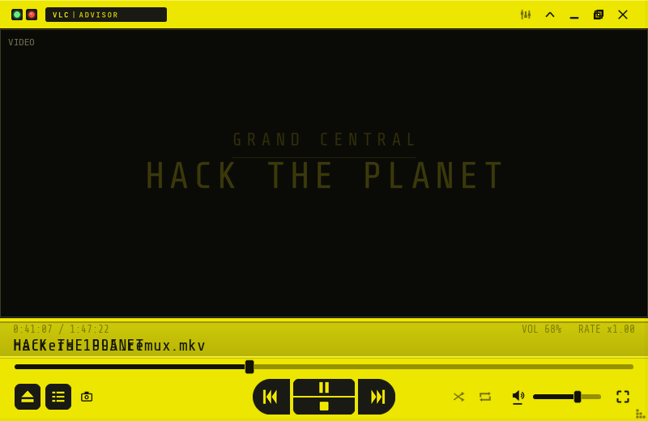
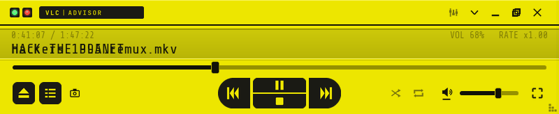
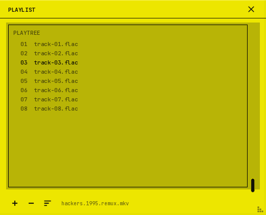
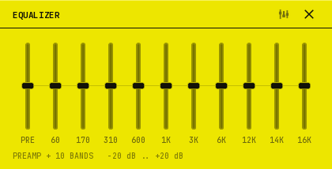

# Cereal Pager

A VLC skin built from one frame of *Hackers* (1995): the yellow Motorola
Advisor pager, mid-message, reading **GRAND CENTRAL / HACK THE PLANET**.

It is not a prop replica. The pager supplies the palette (`#EDE600`), the
two-line LCD readout, the dark rubber keys and the left/right/up/down nav
rocker; everything else is flattened, squared up and given room to breathe.
No bevels, no scuffs, no drop shadows.

**Nothing sits to the left or right of the picture.** Chrome lives in a 36px
header and a 128px deck, and the video runs edge to edge between them.



## Install

1. Grab `dist/CerealPager.vlt` (or build it — see below).
2. VLC → **Tools → Preferences → Interface**
3. Choose **Use custom skin**, browse to the `.vlt`, click **Save**.
4. Restart VLC.

To get back to the stock interface, pick **Use native style** in the same place.

Tested against VLC 3.x on Windows. The skins2 interface is Windows/Linux only —
macOS builds of VLC do not load skins.

## What's in it

| Layout | Size | What it is |
| --- | --- | --- |
| `normal` | 800×520, resizable | Header, full-bleed video, deck |
| `compact` | 800×164, resizable width | Lid shut — header and deck, no picture |
| `pl_normal` | 520×420, resizable | Playlist on a lit LCD field |
| `eq_normal` | 420×214, fixed | Preamp plus 10 bands |
| `fsc_bar` | 720×64, resizable | Fullscreen controller, docked south |

**Header** — two status LEDs (green for playing, red for paused or recording),
the `VLC | ADVISOR` plate, then equalizer, collapse, minimise, maximise, quit.
Drag anywhere on it.

**Readout** — line one is dim: elapsed / total, volume, playback rate. Line two
is the big one: the stream name, scrolling when it's too long, and
`HACK THE PLANET` when nothing is playing.

**Seek and volume** are real filled bars, not bare grooves — the fill is a
61-frame (seek) and 21-frame (volume) sprite sheet indexed by the slider's
value, which is how skins2 animates a slider background.

**Nav rocker** — prev and next are the end caps, play/pause is the top of the
centre bar, stop is the bottom. The cluster lives in its own panel so it stays
centred and rigid at any window width.

**Everywhere** — right-click opens VLC's full popup menu, drag and drop a file
onto any window to play it, and the bottom-right grip resizes.







## Build it yourself

```powershell
pip install pillow
.\build.ps1
```

```bash
pip install pillow
./build.sh
```

Either one regenerates every PNG from `tools/generate_assets.py`, rewrites the
`<Bitmap>` block, re-renders the previews, validates `theme.xml`, and packages
`dist/CerealPager.vlt`.

Nothing in `assets/` is hand-drawn — it is all code, so a palette change is a
one-line edit in `tools/palette.py` followed by a rebuild. `docs/BUILD.md` has
the detail and `docs/DESIGN.md` explains the grid.

## Layout

```
       0 ┌──────────────────────────────────────────────┐
         │ ●●  VLC | ADVISOR              ⌁ ⌃ − ▫ ✕     │  header  36
      36 ├──────────────────────────────────────────────┤
         │                                              │
         │                   video                      │  stage   flex
         │                                              │
     H-128├──────────────────────────────────────────────┤
         │ 0:41:07 / 1:47:22            VOL 68%  x1.00  │  readout 44
         │ hackers.1995.remux.mkv                       │
         │ ▓▓▓▓▓▓▓▓▓▓▓▓●───────────────────────────────  │  seek     6
         │ ⏏ ☰ ▣        ◀◀ ▐ ▶ ▌ ▶▶       ⤫ ⟳ ◀) ▬▬  ⛶ │  controls 48
       H └──────────────────────────────────────────────┘
```

## Credits and licence

Skin by Don Liggett. MIT — see `LICENSE`.

Fonts are bundled and are **not** covered by that licence: Share Tech Mono and
JetBrains Mono, both SIL Open Font License 1.1. See `fonts/FONTS.md`.

*Hackers* (1995) is MGM/UA's. This is a fan-made colour scheme; no film assets
are used or redistributed here. Every pixel in `assets/` is drawn by the
generator in this repo.
